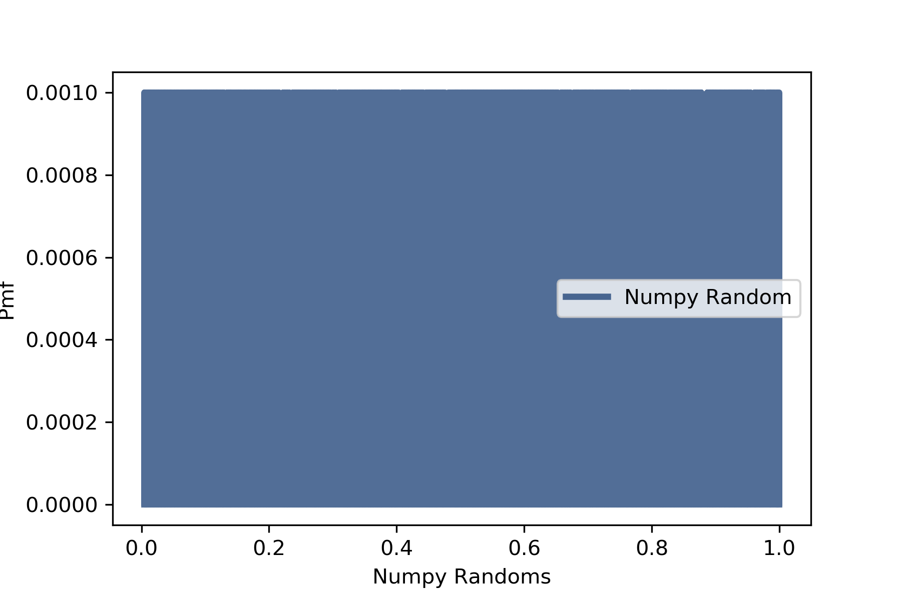
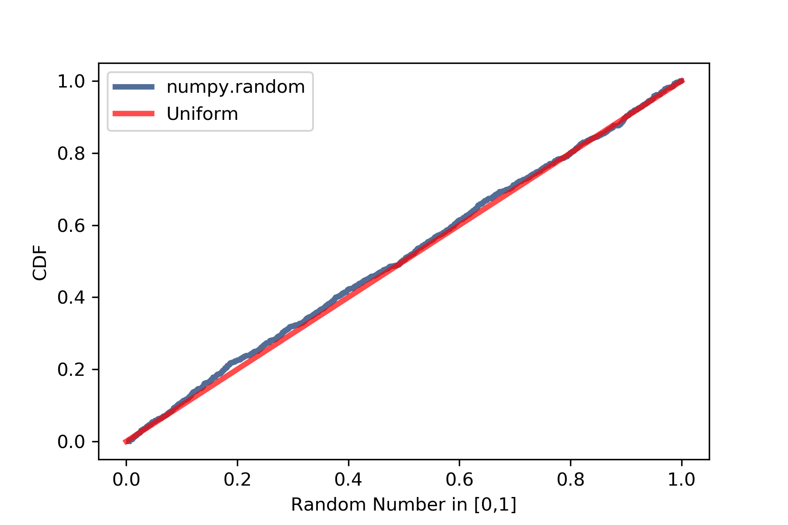

[Think Stats Chapter 4 Exercise 2](http://greenteapress.com/thinkstats2/html/thinkstats2005.html#toc41) (a random distribution)

**Exercise 4.2** The numbers generated by `random.random` are supposed to be uniform between 0 and 1; that is, every value in the range should have the same probability.

Generate 1000 numbers from random.random and plot their PMF and CDF. Is the distribution uniform?

```python
%matplotlib inline
import numpy as np
import thinkstats2
import thinkplot
np.random.seed(42)
nums = np.random.random(1000)
pmf = thinkstats2.Pmf(nums, label='Numpy Random')
thinkplot.Pmf(pmf)
thinkplot.Config(xlabel='Numpy Randoms', ylabel='Pmf')
```

This plot is not useful since each value in unique given the number of significant figures and between values the pmf is zero which causes the whole graph to be solidly colored with the pmf line.

Instead, plot the cdf and compare it to the cdf of the exactly uniform distribution (x=y line):

```python
cdf = thinkstats2.Cdf(nums, label='Numpy Random')
thinkplot.Cdf(cdf)
thinkplot.Plot([0,1],[0,1],color='red',label='Uniform')
thinkplot.Config(xlabel='Random Number', ylabel='CDF')
```

 

Going back and removing (commenting out) the random seed shows numpy.random cmf lines that vary slightly around uniform as expected.

The above content is implemented in the juypter notebook [chap04.ex2.ipynb](https://github.com/spdavern/dsp/blob/master/lessons/statistics/code/chap02ex2.ipynb).

